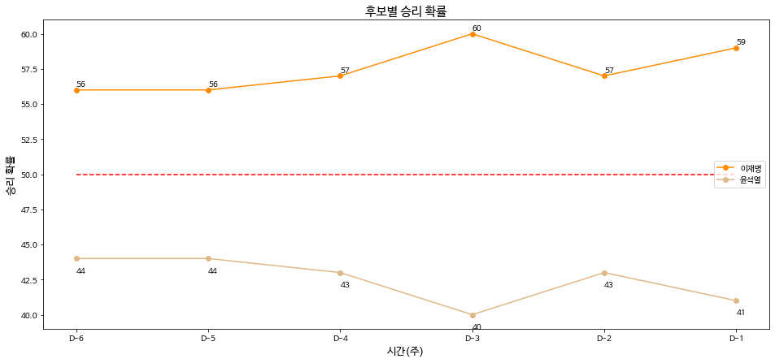
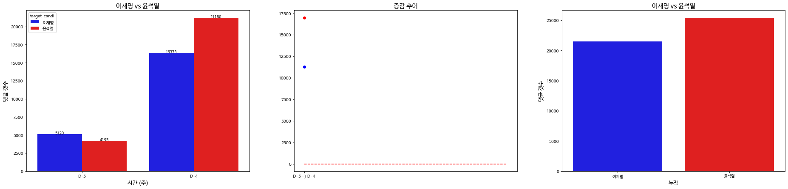
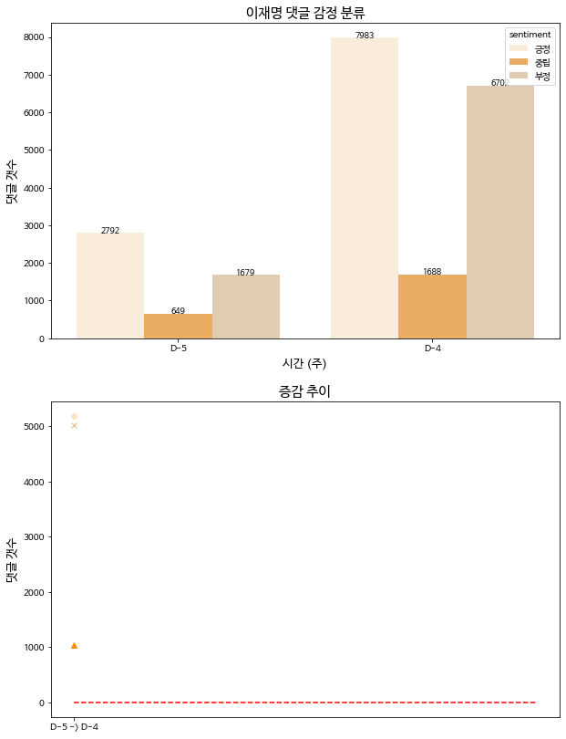
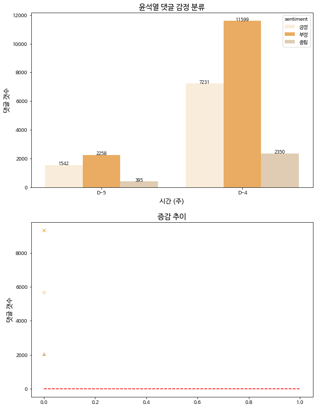
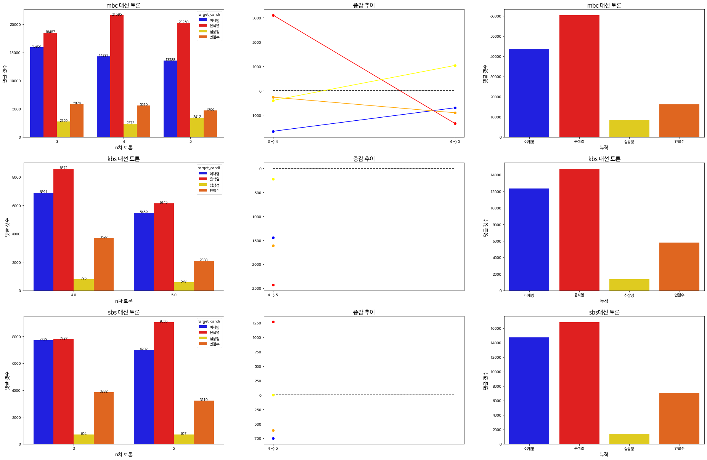
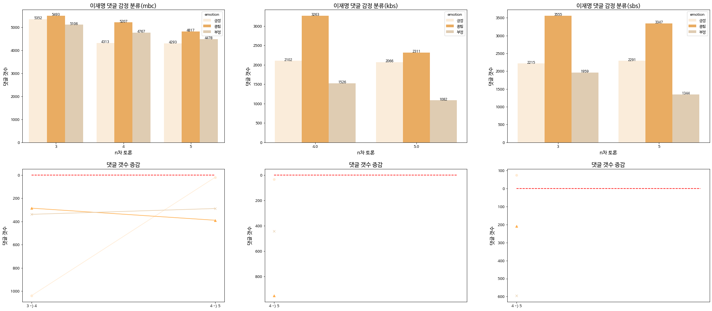
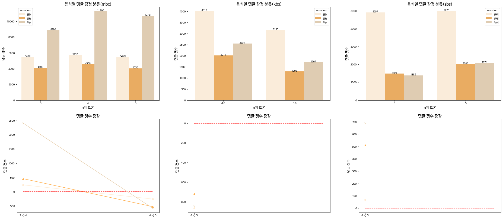
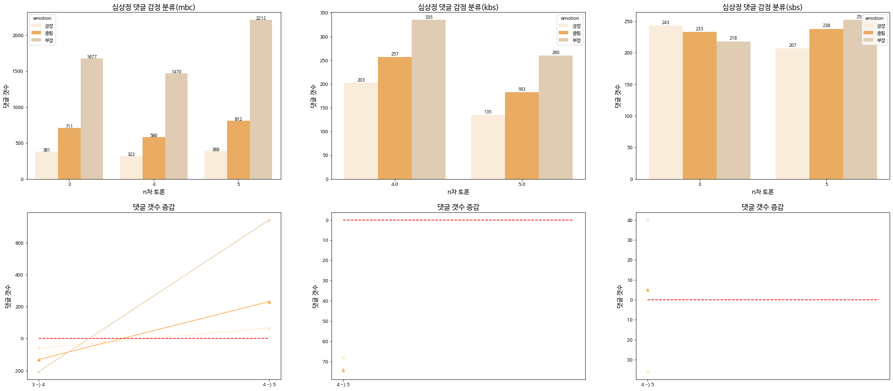
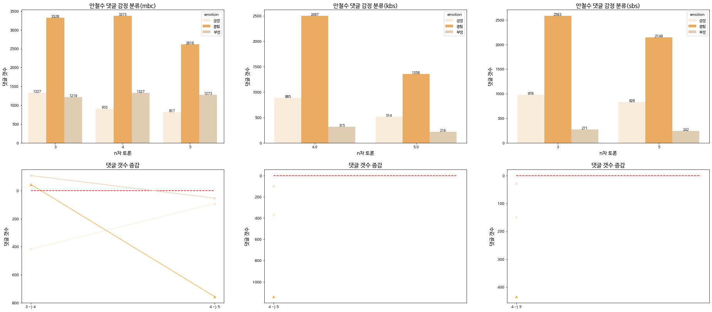

# president-modeling

해당 레포지토리는 대선 예측 모델에 대한 학습 및 추론, 자연어 전처리, 그리고 예측 결과 시각화를 다룬다.

두 가지 모델 및 output을 가진다 : **(1) 당선자 예측 (2) 댓글 감정 분류**

  

# 제20대 대통령 선거 예측 결과

## **(1) 당선자 예측**

### **개요**

- 목표 : 검색어 트렌드에 기반하여 **이재명 후보 VS 윤석열 후보** 중 당선자를 예측해보았다. **3월 9일 선거일까지 총 6주 간** 검색어 변화에 따른 당선자를 예측한다.
- 데이터 : 제21대 총선의 모든 지역의 경합에서 1등 & 2등 후보자 각각에 대한 검색어 트렌드에 따른 당선 결과를 학습 데이터로 사용했다.
- 모델 : LGBM 이진 분류 모델 활용

### **대통령 선거 당선자 예측 결과**

 # 예측 결과 

|후보 \ 기간|6주 전|5주 전|4주 전|3주 전|2주 전|1주 전||평균|
|:---:|:---:|:---:|:---:|:---:|:---:|:---:|--|:---:|
|이재명|56%|56%|57%|60%|57%|59%||57.5%|
|윤석열|44%|44%|43%|40%|43%|41%||42.5%|

모든 구간에서 이재명 후보의 당선 확률이 우세했다.

 # 원본 데이터 소스 
- Naver DataLab
- Google Trends

## **(2) 댓글 분석 및 긍정/부정 평가**

### **개요**

- 목표 : 대선 후보 토론 등의 유튜브 영상으로부터 댓글을 분석해보았다. 각 후보자에 대한 **댓글량의 추이와 해당 댓글들의 긍정/부정 평가**를 분석하여 **각 후보자가 얼마나 관심을 받고 있는지, 사람들이 어떤 반응을 보이는지를** 가늠해본다. 또한 앞선 당선자 예측과 흐름을 비교해본다.
- 데이터 : (* 데이터 소스를 다르게 하였기 때문에, 댓글 분석을 두 파트로 나눠서 진행한다.)
    - **댓글 분석 Part1** : 대선 5주 전 ~ 4주 전까지 1차 토론회 영상 및 특정 유튜브 채널 등의 심층인터뷰 영상
    - **댓글 분석 Part2** : 대선 3주 전 ~ 1주 전까지는 토론회 각 회차별(3차/4차/5차) 분석으로 대체한다.
    - 감정분류 모델 학습용 데이터 : 감정분류 모델 학습을 위해 AI Hub 및 NSMC 데이터를 활용
- 모델 : KoBERT 감정분류(긍정/중립/부정 3 classes) 사전학습 모델

### **댓글 분석 Part1 : 5주 전 ~ 4주 전 (1차 토론회 및 인터뷰 영상)**

 # 전체 댓글량 추이 

- 1주일이 지나며 윤석열 후보에 대한 댓글량이 좀 더 많아졌다. 
- 전체 댓글량은 윤석열 후보에 대한 댓글량이 약간 더 많았다.

 # 이재명 긍정/부정 추이 

 # 윤석열 긍정/부정 추이 

- 이재명 후보에 대한 긍정 평가는 부정 평가보다 좀 더 앞서는 반면, 윤석열 후보에 대한 부정 평가는 긍정 평가를 더 많이 앞선다.
    - 즉, **윤석열 후보에 대한 부정적인 감정을 표출하는 댓글이 더 많았다.**
    - 5주 전 ~ 4주 전 댓글 데이터의 상당수가 심프로 채널의 인터뷰 영상에서 발췌했는데, **경제 이슈에 관심이 많은 시청자들의 견해가 반영된 것**으로 보인다.
- 1주일의 시간이 지나도 각 후보 모두 긍정/부정 평가의 비율은 크게 변하지 않았다.

 # 원본 데이터 소스 
- 삼프로 채널 인터뷰
    - [이재명 후보](https://www.youtube.com/watch?v=y6DlTb3t8Bo)
    - [윤석열 후보](https://www.youtube.com/watch?v=DFzn7PP7--0)
- 1차 TV 토론회 요약 유튜브 영상
    - ([토론회 일정](https://ko.wikipedia.org/wiki/%EB%8C%80%ED%95%9C%EB%AF%BC%EA%B5%AD_%EC%A0%9C20%EB%8C%80_%EB%8C%80%ED%86%B5%EB%A0%B9_%EC%84%A0%EA%B1%B0_%ED%9B%84%EB%B3%B4_%ED%86%A0%EB%A1%A0%ED%9A%8C))
    - (YTN) 이재명 후보 [정책](https://www.youtube.com/watch?v=0jLe1UsUrr4) & [자유토론](https://www.youtube.com/watch?v=QiHvk-1avLU)
    - (YTN) 윤석열 후보 [정책](https://www.youtube.com/watch?v=YsL8aEK0vU4) & [자유토론](https://www.youtube.com/watch?v=Ropug1gzlHQ)

### **댓글 분석 Part2 : 3주 전 ~ 1주 전 (3차/4차/5차 토론회 라이브 영상)**

 # 전체 댓글량 추이 

- 라이브 영상의 라이브 댓글 중 후보자를 지칭하는 이름, 별명 등에 따라 각 후보자별 댓글을 분류하여 추출하였다.
- **방송3사** 모두 4대 정당 각 후보자들에 대한 **댓글 총량의 순위는 같았다** : 1.윤석열 2.이재명 3.안철수 4.심상정

 # 이재명 긍정/부정 추이 

 # 윤석열 긍정/부정 추이 

 # (번외) 심상정 긍정/부정 추이 

 # (번외) 안철수 긍정/부정 추이 

- 방송3사 중 KBS와 SBS는 긍/부정 평가 분포가 비슷했다(심상정 후보 제외)
- 3회의 토론회를 거치며 시간이 지나도 각 후보자들에 대한 긍정/부정 평가가 크게 달라지진 않았다.
- 이재명 후보에 대한 긍정/부정 비율은 방송사별로 크게 차이나진 않았으나, **윤석열 후보에 대한 긍정/부정 비율은 (MBC) VS (KBS & SBS)에서 선호도가 명확히 갈렸다.**

 # 원본 데이터 소스 
- 3차/4차/5차 TV 토론회 유튜브 라이브 영상
    - ([토론회 일정](https://ko.wikipedia.org/wiki/%EB%8C%80%ED%95%9C%EB%AF%BC%EA%B5%AD_%EC%A0%9C20%EB%8C%80_%EB%8C%80%ED%86%B5%EB%A0%B9_%EC%84%A0%EA%B1%B0_%ED%9B%84%EB%B3%B4_%ED%86%A0%EB%A1%A0%ED%9A%8C))
    - KBS : [4차](https://www.youtube.com/watch?v=NZI6enJyiR0) / [5차](https://www.youtube.com/watch?v=Z2GpDOiIbuA)
    - MBC : [3차](https://www.youtube.com/watch?v=HN880gArePI) / [4차](https://www.youtube.com/watch?v=b4_aLaLP1IU) / [5차](https://www.youtube.com/watch?v=BH7c-fcVdbc)
    - SBS : [3차](https://www.youtube.com/watch?v=NrgDD-M2Oro) / [5차](https://www.youtube.com/watch?v=JaTKpnCE-to)

## **총평 및 피드백**

### 전체 피드백

제20대 대선 개표 결과 : 윤석열 당선(48.56%), 이재명 낙선(47.83%)

- 당선자 예측 결과 리뷰
    - 이재명 후보가 더 높은 확률로 당선될 것을 예측한 결과와 다른 결과가 나왔다.
    - 선거일 전까지의 여론조사와도 상반되는 예측 결과였다. (갤럽 여론조사 : 윤석열 46%, 이재명 40%)
    - 이는 학습 데이터에 불균형 요소에 따른 편향된 요소 등이 포함된 것이 원인이라고 추측된다 : 민주당이 압승한 지난 총선 데이터뿐이었다는 점 / "검색어 트렌드" 데이터는 호감도와 정비례하진 않는다는 점 등
- 방송3사에서 각각의 방송사별 댓글 분류 결과 리뷰
    - MBC에서 예상보다 더 이재명 후보에 대한 긍정vs부정 비율이 극명하지 않았다는 점이 눈에 띈다. 긍정이 더욱 높고 부정이 더욱 낮을 것이 예상되었으나 비율이 거의 반반이었다.
    - 전반적으로 윤석열 후보는 긍/부정이 많고 중립이 적은 반면, 이재명 후보는 중립의 비율이 상당히 높았다.
    - 그 밖에 다른 방송사에서 댓글을 더 모아서, 언론사별로 정치 성향에 따라 실제 후보자 호감도가 어느정도인지 비교를 해 보지 못한 점이 아쉽다.
- (공통) 개선 여지가 있는 사항들
    - 각 후보자에 대한 호감도만 측정하는 것이 아니라, 정당 선호도 또한 반영
    - 수집한 데이터에 대한 면밀한 사전 분석
    - 인터넷 기사 & 유튜브 상에 댓글로 정치적인 의사 표현을 하는 사람들은 특정 연령층이 대부분일 것으로 추정되는데, 모든 연령층을 아우를 수 있는 수집 방법 또는 데이터 소스 확보

### 마치면서

여론조사와 같은 표본에 기반한 조사와 달리, 실제 많은 사람들의 의견을 반영할 수 있도록 대선 예측을 수행하였다.

당선자 예측 결과가 빗나간 것은 아쉽지만, 분석 결과를 통해 편향된 데이터의 효과를 직접 확인할 수 있었다. 또한 댓글 분석에서 몇 가지 흥미로운 양상을 관찰한 점 등 이번 대선에서 사람들이 어떻게 생각하는지를 엿볼 수 있었다. 그리고 데이터 소스를 선정할 때 대선 결과를 예측한다는 주제에 맞춰 사람들의 세대별 성향, 플랫폼별 정치 성향 등 고려해야할 여러가지 사항들에 대해서도 알 수 있었다.

